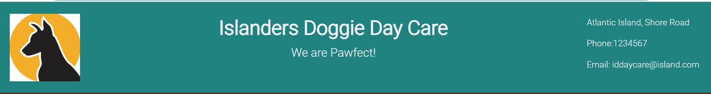

# ISLANDERS DOGGIE DAY CARE
## [Link to the deployed application](https://dog-day-care-8fab57d98aa7.herokuapp.com/)

## CONTENTS
---
* [USER EXPERIENCE](#user-exp)  

    *  [Wireframes](#wireframes)

    *  [Kanban Board](#kanban-board)  

* [DESIGN](#design)  

    * [Colour Scheme](#colour-scheme)  
    * [Flowchart](#flowchart)
    * [Database schema](#database)  

* [FEATURES](#features)

    * [Features to implement](#features-to-implement)

* [TECHNOLOGIES USED](#technologies-used)  

    * [Languages and Libraries Used](#languages-libraries-used)
    * [Frameworks and Programes Used](#frameworks-programs) 

* [TESTING](TESTING.md)  

* [DEPLOYMENT AND LOCAL DEVELOPMENT](#deployment-development) 

    * [Deployment](#deployment)  

    * [Local Development](#local-development)  

        * [How To Fork](#how-to-fork)
        * [How To Clone](#how-to-clone)
        * [Using GitPod](#using-gitpod)

* [CREDITS](#Credits) 

    * [Code Used](#Code-Used)
    * [Acknowledgments](#Acknowledgments) 

## USER EXPERIENCE (UX) 

* Wireframes 

    

    
    
* Kanban Board 
    

* Epics

    
    
    
    
    

 ---
 ### User Stories 

 * As a User I want to learn about the business.
 * As a User I want to know how to contact the business.
 * As a User I want to learn what other customers experience was.
 * As a user I would like to leave my testimonial and comment of testimonials of others.
 * As a user I would like to check the businesses social media accounts.
 * As a user I would like to make a reservation for my dog

 #### As a returning User I want to easily sign in to make a reservation for my dog. 

---
 ## DESIGN 
 ---
 ### Colour Scheme 

 The colour scheme used was defined on coolors

---

## The Flow Chart
 
---

## The Datbase Schema

 ---
 ## THE FEATURES 
--- 
 * The Application consist of 3 pages- Home- Index page, Testimonials and Reservations

    * Main Logo

    

    *  Header

     

    * Navigation Bar

     

    * Why Choose Us section

     

    * Image Carousel

    

    * Our Story Section

    

    * Pricing Section

    

    * Footer with Social Media Icons

    
    

    * Customers Testimonials and Commenting Section on Testimonials Page

    
    

    * Reservations Section on Reservations Page
    
    
    

---
### Features to implement 
* Add making reservations for more than one dog at a time
* Add options for dog walking services only

---
## TECHNOLOGIES USED 
---
### Languages and Libraries Used 

* [Django](https://www.djangoproject.com/) - was used to write the application.
* [Bootstrap](https://getbootstrap.com/docs/4.0/getting-started/introduction/) - was used to style the application.
* [HTML5](https://html.com/html5/) - Was used to create the applications fron-side structure.
* [CSS](https://developer.mozilla.org/en-US/docs/Web/CSSS) - was used to add custom CSS style.
* [jQuery](https://jquery.com/) - was used to add interactivity to the footer.
* [dj_database_url](https://pypi.org/project/dj-database-url/) - used to allow urls to connect to the postgres db

### Frameworks and Programs Used  

* [Git](https://git-scm.com/) - for version control. 
* [GitHub](https://github.com/) - to store the project files.
* [GitPod](https://www.gitpod.io/) - as the CDE for development.
* [Heroku](heroku.com) - was used to deploy the progect.
* [Lucidchart](https://www.lucidchart.com/) - to create the flow chart and database schema.
* [Google Fonts](https://fonts.google.com/) - used for Roboto and Prompt fonts.
* [Font Awesome](https://fontawesome.com/) - used for social media icons.
* [Balsamiq](https://balsamiq.cloud/) - used to create wireframes.
* [Gunicorn](https://docs.djangoproject.com/en/4.2/howto/deployment/wsgi/gunicorn/) - used as the Web Server to run Django on Heroku.
* [pscopg2](https://pypi.org/project/psycopg2/) - used as a database adapter to support the connection to database
* [Cloudinary](https://cloudinary.com/) - used to store the images that could be uploaded to testimonials.
* [Django allauth](https://django-allauth.readthedocs.io/en/latest/) - used for accounts registeration and authentication
* [Django crispy forms](https://django-crispy-forms.readthedocs.io/en/latest/) - used to simplyfy form rendering
---
## [TESTING](TESTING.md)

Results of the testing of the programe are available in another file. You can visit is by clicking on a link above.
---
## DEPLOYMENT AND LOCAL DEVELOPMENT 
---
### Deployment 

Before deploying, make sure your requirements.txt is updated 

This project was deployed in Heroku and the steps to deploy are:

1. Create an account and login to Heroku.
1. On the dashboard, click the button NEW --> to create a new app on the right side of the webpage.
1. Choose a name for the app and choose your region. Click --> Create app.
1. Go to the Settings tab, Scroll down to the Config Vars. Add key PORT and value of 8000.
1. Create Postgress DB on Heroku.
1. Configure Cloudinary to host images on application.
1. Go to Deploy tab, Select GitHub as Deployment Method and connect your account.
1. Enter the name of your respository and connect.
1. Select the Branch and click- Connect Branch.

### Local Development 

#### How to Fork

1. Log in or Sign up to GitHUb
1. Go to this project repository: (https://github.com/jjanczynska/doggie-daycare/).
1. On the right hand side of the repository, there is a button with FORK on it --> click it.
1. A ne page "Create a ne Fork" will open, you can also edit the name if you would like.
1. At the bottom of the page - click on CREATE FORK.
1. Now, you have a copy of the project in your repositories.

#### How to Clone

1. Log in or Sign Up to GitHub
1. Go to this project repository: (https://github.com/jjanczynska/doggie-daycare/).
1. Click on the CODE button and select if you would like to clone with : HTTPS, SSH or GitHub CLI and copy the link.
1. Open the terminal in the code editor of your choice, and change the current working directory to the one you will use to clone the repository.
1. Type: "git clone" into the terminal and then paste the link you copied before, and press ENTER.

#### Using GitPod

If you would like to edit the copy of ths repository in GitPod, follow this steps:
1. Install the GitPod extension on your browser of choice.
1. On GitHub open the project repository you forked.
1. On the top of the page, on the right hand side, click the green button with GitPod, click it.
1. It opens the GitPod website. If you are a first time user - connect it to your GitHub account and authorize gitpod-io. In the next step - create your account.
1. GitPod will create your Workspacem which may take a while. After the workspace has been loaded, you can start editing in GitPod.
---
## CREDITS
---
1. Logo was copied from a free source (https://www.vecteezy.com/)
1. Images used on the index page in the carousel feature were taken as a free saurce from (https://pixabay.com/)

### Code Used

#### I have used various documentation to and web resources to build this project. To make it fully responsive Bootstrap library was used and then I build upon that with custom CSS.

*  Image carousel- [How to build a Bootstrap carousel](https://getbootstrap.com/docs/5.1/components/carousel/), [How to manage static images in Django](https://docs.djangoproject.com/en/3.2/howto/static-files/), [How to make images responsive in Bootstrap](https://getbootstrap.com/docs/5.1/content/images/#responsive-images).

*  Change icon to text in the footer- jquery was used to build that code snippets- references: [ready() method](https://api.jquery.com/ready/),
[data() method](https://api.jquery.com/data/), [html() method](https://api.jquery.com/html/), [hover() method](https://api.jquery.com/hover/).

*  looping through testimonials and adding comments, Cross Site Request Forgery protection, Use of Crispy Forms, Django user Authentication, date formatting- Idea was taken from CI Django Blog project, [Use of Bootstrap Cards](https://getbootstrap.com/docs/5.1/components/card/). 

*  Models.py was influenced by 2 walk through Django projects by Code Institute, I have also read through [Django documentation on models](https://docs.djangoproject.com/en/4.2/topics/db/models/).

* Forms.py was helped along by [Django documentation on froms](https://docs.djangoproject.com/en/4.2/topics/forms/).

* Views.py was influenced by 2 walk through Django projects by Code Institute, I have also read through [Django documentation on forms](https://docs.djangoproject.com/en/4.2/topics/forms/)

* Admin action on approving testimonials- that was added to give admin power to [approve testimonials before publishing](https://docs.djangoproject.com/en/3.1/ref/contrib/admin/actions/) and [buid upon Admin permissions](https://books.agiliq.com/projects/django-admin-cookbook/en/latest/).
---
### Acknowledgments

Thank you to my mentor Spencer Barribal and to my family for help with testing the responsiveness of the project.

