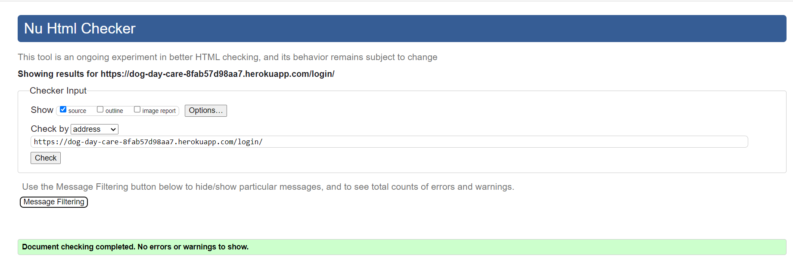

# ISLANDER DOGGIE DAY CARE TESTING
---
### [Link to the deployed application](https://dog-day-care-8fab57d98aa7.herokuapp.com/)

## CONTENTS
---
* [AUTOMATED TESTING](#automated-testing)

  * [HTML Validator](#html-validator)
  * [Jigsaw Validator](#jigsaw-validator)
  * [CI Python Linter](#ci-python-linter)
  * [Lighthouse](#lighthouse)

* [MANUAL TESTING](#manual-testing)

  * [Testing User Stories](#testing-user-stories)
  * [Full Testing](#full-testing)

* [BUGS](#bugs)

  * [Known Bugs](#known-bugs)

Testing was conducted throught the project development cycle.

## AUTOMATED TESTING

### HTML Validator

---
### Jigsaw Validator
---

### CI Python Linter
---
#### Models.py

#### Forms.py

#### Views.py

#### local Urls.py

#### main urls.py

### Lighthouse
---
I have used Chrome Dev Tools Lighthouse to test the performance, accsesibility and best practices for home, testimonials, reservations and login pages

## Maual Testing
---
### Testing User Stories

| GOALS | HOW ARE THEY ACHIEVED |
| :--- | :--- | 
| As a User I want to learn about the business | Achieved by including a "Why Choose Us" section and "Our story" Section on index page | 
| As a User I want to know how to contact the business | Achieved by providing contact information in the header and social media links in the footer | 
| As a User I want to learn what other customers experience was | Achieved by inclusindg testimonials and comments page | 
| As a user I would like to leave my testimonial and comment of testimonials of others| Achieved by creating testimonials and comment models, views and forms| 
| As a user I would like to check the businesses social media accounts| Achieved by implementig social media icons with links in the footer | 
| As a user I would like to make a reservation for my dog| achieved by implementinhg a reservations system on the website | 

---
### Full Testing

| Feature | Expected Outcome | Testing Performed | Result | Pass/Fail |
| :--- | :--- | :--- | :--- | :--- |
| Links in the navbar | Navigation to chosen sections| testing the links  | Links connecting to targets | PASS |
| Image Carousel on the index page | scrolling through images | scrolling through images | working as intended | PASS |
| Section in pricing changing colour on hover | colour change on hover | hovering over the section | Colour changes on hover | PASS |
|  Social Media Icons | Linking to social media sites | clicking to link to sites | leading to a social media site | PASS |
| Social media Icons changing to display-Follow Us text on hover | icon changes to text | hover and then unhover over the icon | as intended | PASS | 
| sign in feature before leading to reservations | able to sign in | signing in | able to sign in | PASS | 
| Reservations form | able to make a reservation | making multiple reservations | as intended | Pass | 
| Ability to return to reservation form after completing the reservation | Return to main reservation page | clicking on return button | as intended | PASS | 
| Adding testimonial to be approved by admin | waiting for approval | adding testimonial and checking admin site |  |  | 
|   |  |  |  | | 
|  |  |  |  |  |
|  |  |  |  |  | 
|  | |  |  | |
|  | |  |  |  |

---
## BUGS
---
### Known Bugs

## RETURN TO [README](README.md)